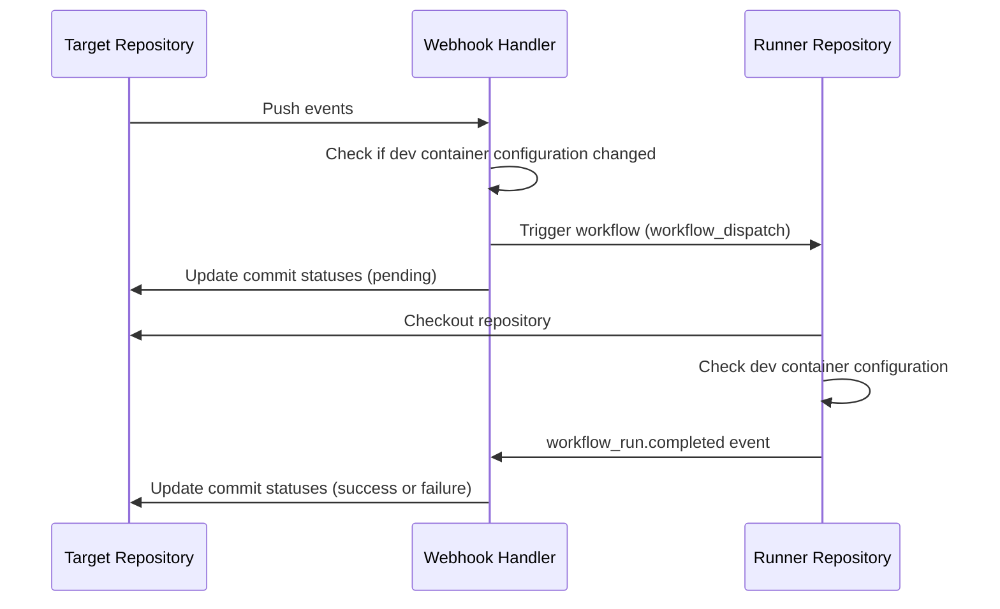

# devcontainer-check

[](https://codecov.io/gh/lasuillard-s/devcontainer-check)

A GitHub App to automate validating your repositories' dev container configuration.

## ❔ How it works

Below is sequence diagram of how this app works:



- **Why use GitHub Actions?**

  To validate, build and test containers. Building containers takes some time and resource-heavy work. We reuse GitHub Actions for it.

- **Why must I self-host this app?**

  We have no infrastructure to run the tasks. If we make it public for unlimited CI minutes, there is security risk of leaking repository contents.

## ⚙️ Getting Started

This app is made for internal use only. You must self-host this application.

### 🤖 Create GitHub App

You should have Node.js, npm installed on your system. Otherwise, you can use Dev Container instead.

```
# Fork or clone this repository
git clone https://github.com/lasuillard-s/devcontainer-check.git

# Move to the project directory
cd devcontainer-check

# Install the dependencies (`npm install`)
npm install

# Build the application
npm run build

# Run the development server
npm run dev
```

Then visit http://localhost:3000 to create a GitHub App with Probot's app registration helper.


### 🚧 Workflow configurations

Go to repository **Settings** > **Security and Quality** > **Secrets and variables** > **Actions** and add below variables as **Repository secrets**:

- **APP_ID**: GitHub App ID
- **PRIVATE_KEY** GitHub App private key

This is required for runner repository to checkout the repository in the check workflow.

### 🚀 Deploy to Vercel

...
