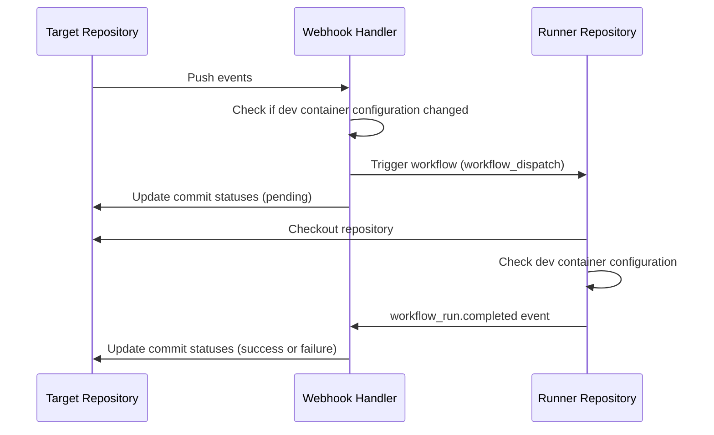
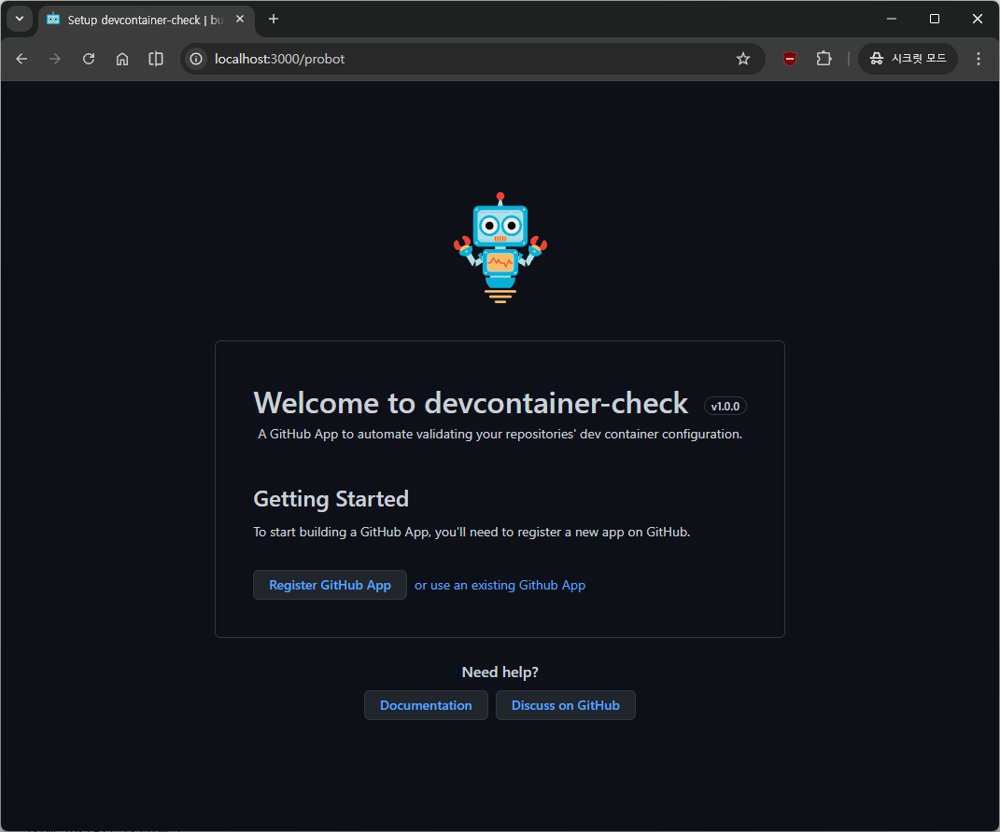
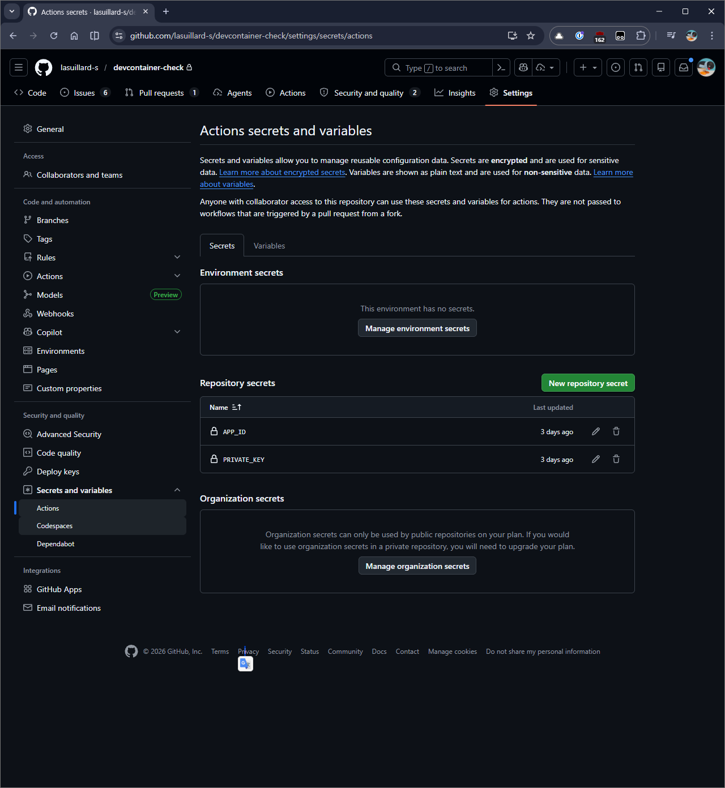

# devcontainer-check

[](https://opensource.org/licenses/MIT)
[](https://codecov.io/gh/lasuillard-s/devcontainer-check)

A GitHub App to automate validating your repositories' dev container configuration.


## ❔ How it works

Below is a sequence diagram describing how this app works:



- **Why use GitHub Actions?**

  To validate, build and test containers. Most validations would be quick, but building and running containers takes some time and resource-heavy work. We reuse GitHub Actions for it.

- **Why should I self-host this app?**

  Because we have no infrastructure to run the tasks, we use the GitHub Actions infra. It will work on your GitHub Actions infra and consume the CI minutes of yours.

## ⚙️ Hosting the application

### 🤖 Create GitHub application

Here we describe creating GitHub App with [Probot GitHub App Manifest Flow](https://docs.github.com/en/apps/sharing-github-apps/registering-a-github-app-from-a-manifest#using-probot-to-implement-the-github-app-manifest-flow). If you know what it is and prefer creating app manually, check the [app.yaml](app.yaml) file for required permissions and events to listen to.

> [!IMPORTANT]
> The app should have permission to access the runner repository as well to receive workflow run completion events.

> [!NOTE]
> Use [public/logo.png](public/logo.png) file to decorate your app if you want.

To get help of Probot, you should have Node.js and npm installed on your system. (or you can use Dev Container instead, which contains all the necessary dependencies by default.)

```
# Fork or clone this repository
git clone https://github.com/lasuillard-s/devcontainer-check.git

# Move to the project directory
cd devcontainer-check

# Install the dependencies
npm install

# Build the application
npm run build

# Run the development server
npm run dev
```

Then visit http://localhost:3000 to create a GitHub App with Probot's app registration helper.



Probot will create **.env** file in the repository with variables such as `APP_ID`, `PRIVATE_KEY`, `GITHUB_CLIENT_ID`, `GITHUB_CLIENT_SECRET`, etc. You will need it soon.

### 🖥️ Runner repository configuration

> [!WARNING]
> It is recommended to make the runner repository private. There's security risk of private repository content being exposed to the public (job logs) if runner repository is public.

The **Runner Repository** is a repository where check jobs run. You can reuse this repository as a runner repository as well (but recommended to make it private).

If you want to separate the runner repository, create a new repository and copy & paste [.github/workflows/devcontainer-check.yaml](.github/workflows/devcontainer-check.yaml) file in the created repository. Just don't forget to ensure the app is installed to the runner repository as well.

Once the runner repository is ready, go to **Settings** > **Security and Quality** > **Secrets and variables** > **Actions**



Add below variables as **Repository secrets**:

- **APP_ID**: GitHub App ID
- **PRIVATE_KEY** GitHub App private key

This is required for runner repository to checkout the repository in the check workflow.

### 👂 Deploy Webhook Handler (app)

You can deploy the webhook handler (app) to Vercel with deploy button:

[](https://vercel.com/new/clone?repository-url=https%3A%2F%2Fgithub.com%2Flasuillard-s%2Fdevcontainer-check&env=NODEJS_HELPERS,APP_ID,PRIVATE_KEY,GITHUB_CLIENT_ID,GITHUB_CLIENT_SECRET,WEBHOOK_SECRET,RUNNER_REPOSITORY&envDefaults=%7B%22NODEJS_HELPERS%22%3A%220%22%7D&project-name=devcontainer-check&repository-name=devcontainer-check)

Description of environment variables used:

| Name                                                               | Value                |
| ------------------------------------------------------------------ | -------------------- |
| [NODEJS_HELPERS](https://probot.github.io/docs/deployment/#vercel) | 0                    |
| APP_ID                                                             | From your GitHub App |
| PRIVATE_KEY                                                        | 〃                   |
| GITHUB_CLIENT_ID                                                   | 〃                   |
| GITHUB_CLIENT_SECRET                                               | 〃                   |
| WEBHOOK_SECRET                                                     | 〃                   |

And app configuration variables (check [src/config.ts](src/config.ts) file for full reference):

| Name                                | Description                                                                                                     |
| ----------------------------------- | --------------------------------------------------------------------------------------------------------------- |
| RUNNER_REPOSITORY                   | **Required**. Full name (e.g. `"lasuillard-s/devcontainer-check"`) of the repository the check jobs should run. |
| CHECK_WORKFLOW_NAME                 | Name of the workflow to be triggered. Defaults to `"devcontainer-check.yaml"`.                                  |
| CHECK_WORKFLOW_REF                  | Git reference (tag or branch) which the workflow run on. Defaults to default branch (`""`).                     |
| CHECK_WORKFLOW_INPUTS_ARTIFACT_NAME | Name of the workflow artifact contain workflow inputs. Defaults to `"workflow-inputs"`.                         |
| CHECK_WORKFLOW_INPUTS_ARTIFACT_PATH | Path to the inputs file within the artifact zip archive. Defaults to `"inputs.json"`.                           |

Once deployed, go to GitHub App settings page you created then update the webhook URL; e.g. `https://<project-name>.vercel.app/api/github/webhooks` to your Vercel app.
