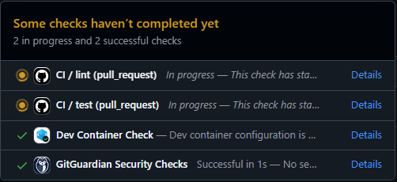
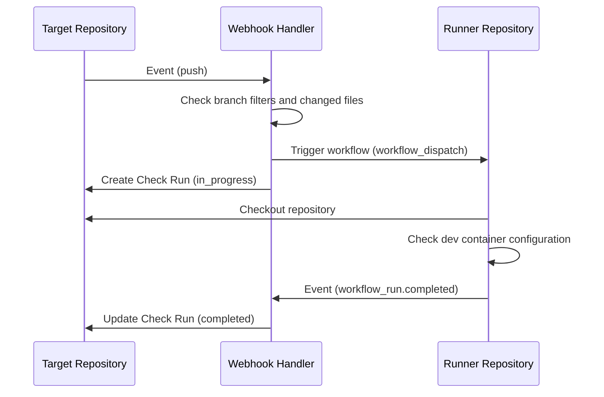

# Devcontainer Check

[](https://opensource.org/licenses/MIT)
[](https://codecov.io/gh/lasuillard-s/devcontainer-check)

A GitHub App that automates validation of your repository's Dev Container.

<p align="center">
  
</p>

## ✨ Features

Devcontainer Check is a TypeScript-based Probot app with these features:

- **Detect Dev Container changes** in `.devcontainer/` and `.devcontainer.example/`
- **Offload validation workflows** to a separate runner repository when Dev Container files change
- **Update commit statuses** on the target repository when the runner workflow completes
- **Support visibility-specific runners** for public and private repositories

## ❔ How it works

This app watches target repositories for `push` events and runner repositories for `workflow_run.completed` events.



- The app only processes push events on branches that match `PUSH_BRANCHES`, or push events whose commits are associated with pull requests whose base branch matches `PR_BRANCHES`.
- When `.devcontainer/` or `.devcontainer.example/` changes, the app dispatches the configured runner workflow and marks the commit as pending.
- When no Dev Container files change, the app marks the commit as successful without dispatching a workflow.
- Runner selection can vary by repository visibility through `RUNNER_REPOSITORY_FOR_PRIVATE` and `RUNNER_REPOSITORY_USE_PUBLIC_FOR_PRIVATE`.

## ⌨️ Registering the GitHub App

To register the GitHub App, clone the repository and run the following commands in a terminal:

```bash
npm install
npm run build
npm run dev
```

Then open `http://localhost:3000` to register and run the app with Probot's local helper.

## 👂 Deploying the webhook handler

This app is configured for Vercel through [`vercel.json`](./vercel.json). This project also offers an option to deploy the app to Vercel using Terraform. See the [`deploy/terraform-vercel`](./deploy/terraform-vercel) directory for deployment instructions.

## 📏 Configuration

The most important environment variables are below. See [`.env.example`](./.env.example) and [`src/config.ts`](./src/config.ts) for the full list and defaults.

| Key                                        | Description                                                                                                      |
| ------------------------------------------ | ---------------------------------------------------------------------------------------------------------------- |
| `APP_ID`                                   | GitHub App ID.                                                                                                   |
| `PRIVATE_KEY`                              | GitHub App private key.                                                                                          |
| `WEBHOOK_SECRET`                           | GitHub webhook secret.                                                                                           |
| `WEBHOOK_PROXY_URL`                        | Optional local webhook proxy URL.                                                                                |
| `RUNNER_REPOSITORY`                        | Required runner repository in `owner/repo` format, used for public (or unknown-visibility) target repositories.  |
| `RUNNER_REPOSITORY_FOR_PRIVATE`            | Optional runner repository used for private target repositories.                                                 |
| `RUNNER_REPOSITORY_USE_PUBLIC_FOR_PRIVATE` | Set to `true` to dispatch private targets to the public runner when no private runner is configured.             |
| `CHECK_WORKFLOW_NAME`                      | Workflow file name to dispatch. Defaults to `devcontainer-check.yaml`.                                           |
| `CHECK_WORKFLOW_REF`                       | Workflow ref to dispatch. Defaults to `~DEFAULT_BRANCH`, which resolves to the runner repository default branch. |
| `CHECK_WORKFLOW_INPUTS_ARTIFACT_NAME`      | Workflow inputs artifact name. Defaults to `workflow-inputs`.                                                    |
| `CHECK_WORKFLOW_INPUTS_ARTIFACT_PATH`      | Workflow inputs file path inside the artifact. Defaults to `inputs.json`.                                        |
| `PUSH_BRANCHES`                            | Comma-separated push branch patterns. Defaults to `~DEFAULT_BRANCH`.                                             |
| `PR_BRANCHES`                              | Comma-separated pull request base branch patterns. Defaults to `~DEFAULT_BRANCH`.                                |
| `ALLOWED_PRINCIPALS`                       | Comma-separated list of allowed principals (users/orgs). Defaults to `*` (all principals allowed). If explicitly empty, all installations are rejected. |

## ⚠️ Limitations

- The app only checks file changes under `.devcontainer/` and `.devcontainer.example/`.
- Pushes on branches outside `PUSH_BRANCHES` are ignored unless they are associated with a pull request whose base branch matches `PR_BRANCHES`.
- Private target repositories require a private runner repository. This prevents private repository content leaks through a publicly exposed runner. You can disable this protection by setting `RUNNER_REPOSITORY_USE_PUBLIC_FOR_PRIVATE` to `true`, but use it at your own risk.
- The runner workflow must upload the configured inputs artifact so the completion handler can map results back to the original commit.

## 💖 Contributing

Please refer to [CONTRIBUTING.md](./CONTRIBUTING.md) for more information about contributing to this project.

## 📜 License

This project is licensed under the MIT License.
