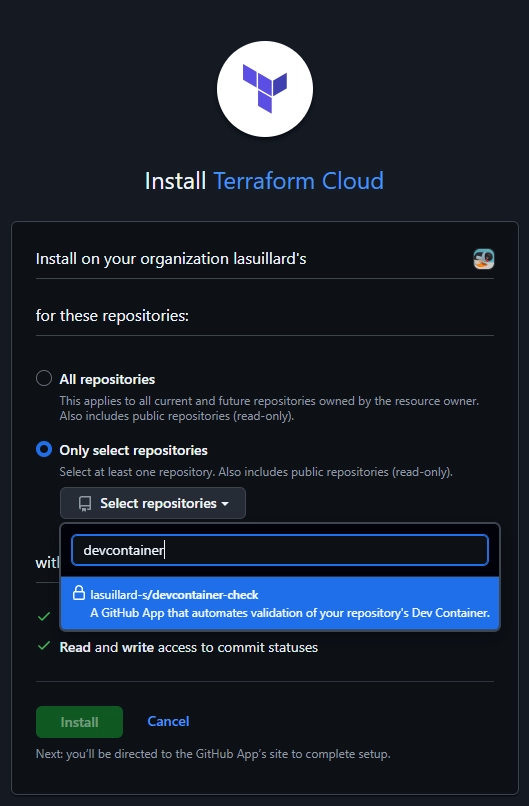
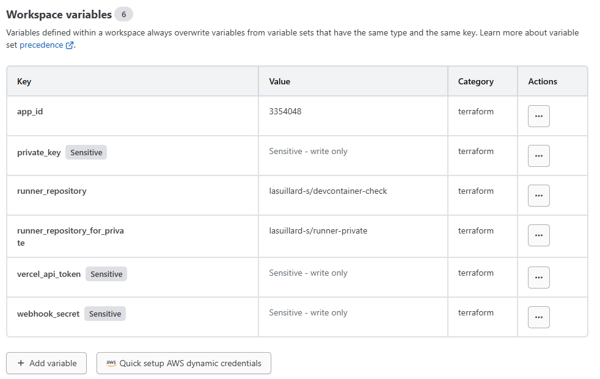
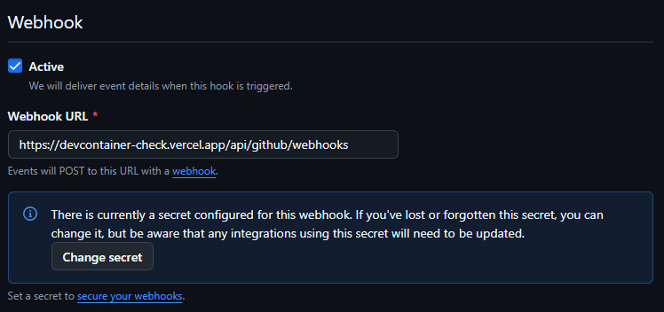

# Deploy to Vercel with Terraform

This guide explains how to deploy the app to Vercel using Terraform Cloud as the state backend (which offers 500 managed resources for free) with a Version Control Workflow.

> [!NOTE]
> You can also use the Terraform CLI to deploy to Vercel, but you will need to manage the state file yourself.

1. Create a new workspace in Terraform Cloud.

   

1. If you have not connected your repository, install the Terraform GitHub App on your account or organization first:

   
   

1. Then choose your repository (fork or clone).

   

1. Click **Advanced options** below and set the **Terraform working directory** to `deploy/terraform-vercel`.

   

1. Go to the workspace settings and add the required workspace variables.

   

1. Click **New run** and start a plan to verify everything is correct, then click **Confirm & apply** at the bottom.

   

1. Update the webhook URL of your GitHub App to the new URL provided by Vercel.

   
