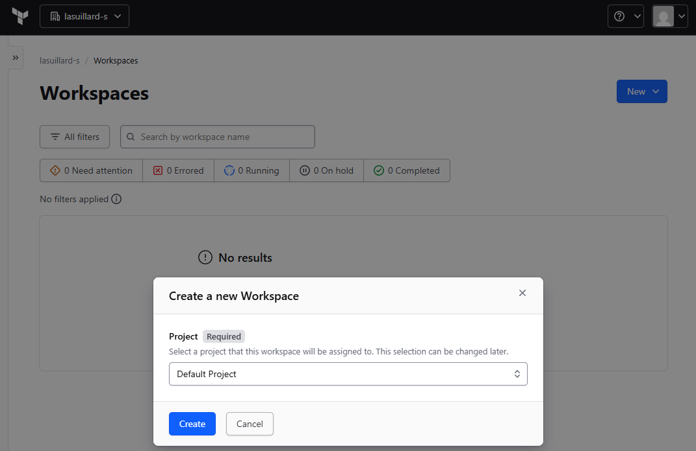
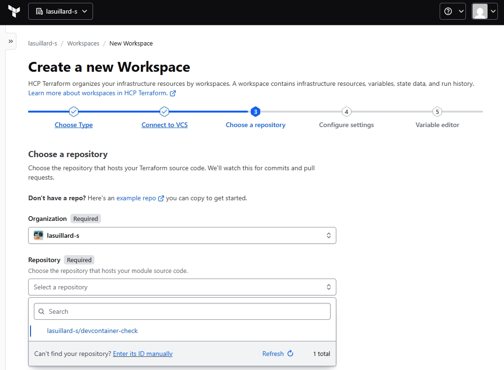
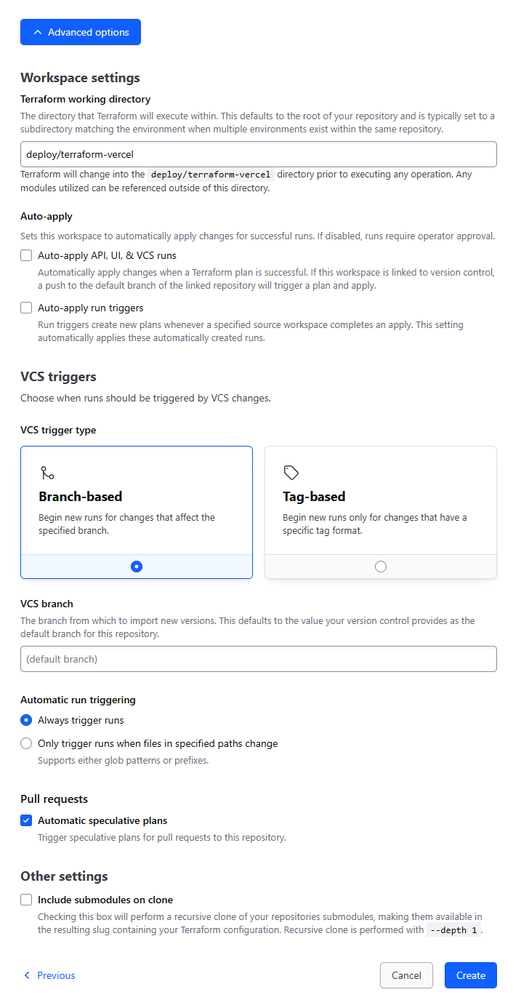
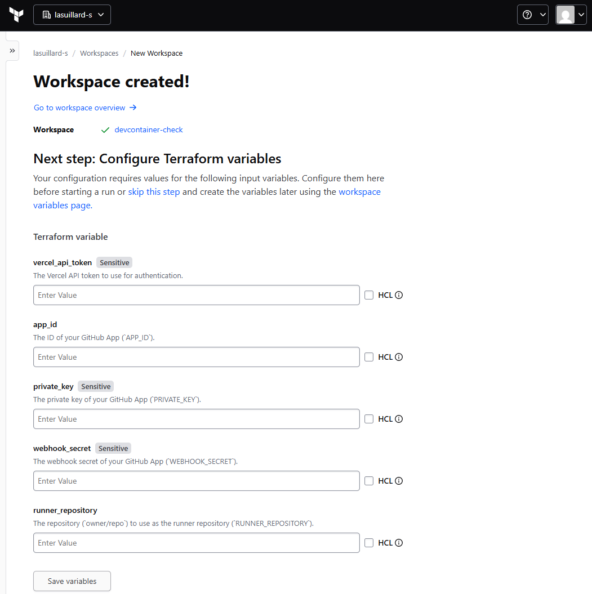
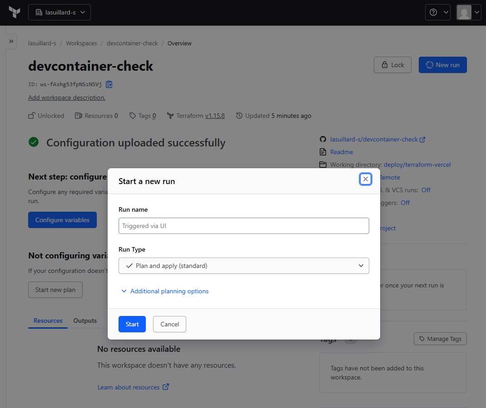
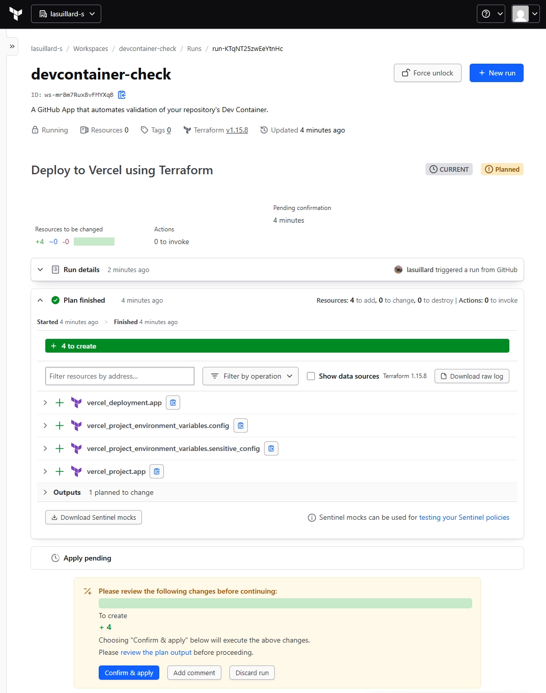
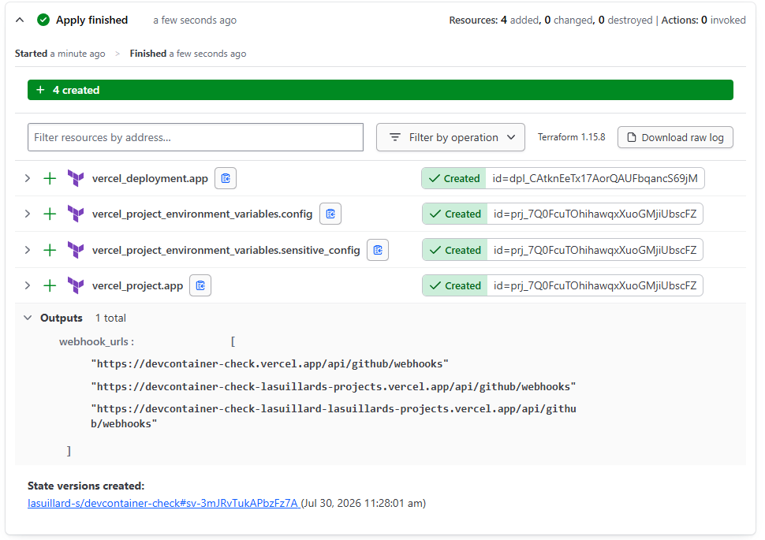

# Deploy to Vercel with Terraform

This guide explains how to deploy the app to Vercel using Terraform Cloud as the state backend (which offers 500 managed resources for free) with a Version Control Workflow.

> [!NOTE]
> You can also use the Terraform CLI to deploy to Vercel, but you will need to manage the state file yourself.

## Create a workspace in Terraform Cloud

First, create a new workspace in Terraform Cloud with **Version Control Workflow**.

## Connect your repository

If you have not connected your repository, install the Terraform GitHub App on your account or organization first:

Then choose your repository (fork or clone).

## Configure your workspace

Click **Advanced options** below and set the **Terraform working directory** to `deploy/terraform-vercel`.

You will be prompted to add variables to your workspace, as follows:

For variables Terraform Cloud does not catch, you can add them manually on the **Variables** page later.

## Deploy the app

Click **New run** and start a plan to deploy the app to Vercel.

Review the plan and click **Confirm & apply** to deploy the app to Vercel.

## Update your GitHub App configuration

Check the outputs for the following steps to complete the setup of your GitHub App.

Finish your GitHub App configuration using the outputs. For example, you need to update the webhook URL to receive events from GitHub.

